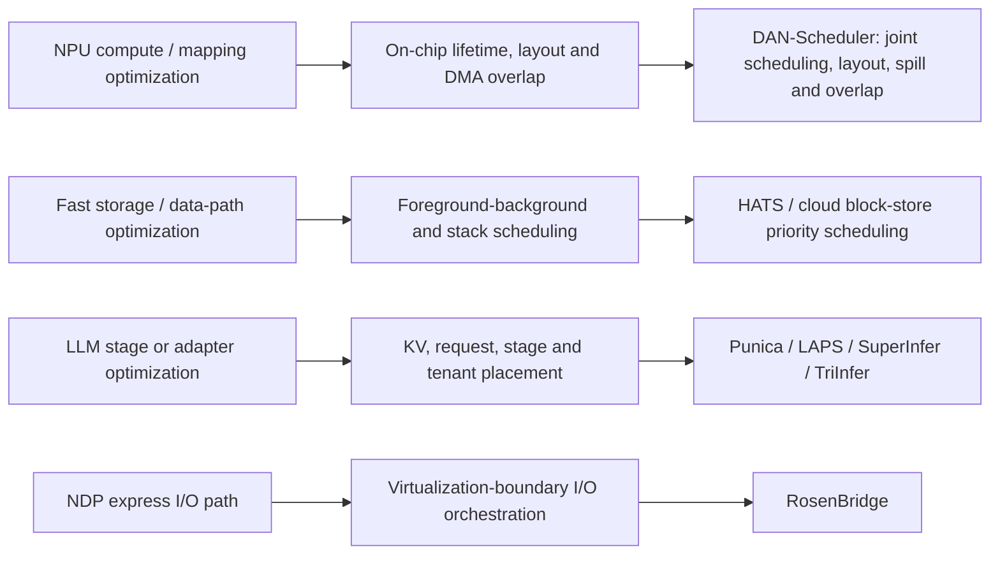

# Problem → competing mechanism → bottleneck-transfer matrix

## Bottleneck-transfer map

| Lineage | Quantified/current trigger | Competing mechanisms checked | Collision class | Discovery decision |
|---|---|---|---|---|
| General-purpose NPU compiler-runtime | Operator order, memory layout and DMA overlap are jointly coupled by limited on-chip capacity. [DAN-Scheduler](https://arxiv.org/abs/2607.17422) already co-optimizes topological scheduling, deterministic layout/repackaging, tier-aware spill, and critical-path overlap on trace-derived DaVinci NPU DAGs. | Separate scheduler/layout/spill/overlap passes; one joint offline optimizer; NPU architecture co-design ([TriGen](https://arxiv.org/abs/2602.12962)). | `DIRECT_FATAL` for a generic joint NPU schedule-layout-overlap proposal. | `DROP`; a narrower “extra scheduling phase” is ordinary tuning, while a broader union duplicates DAN's primary action set. |
| NPU runtime lifecycle | [SynapticOS](https://arxiv.org/abs/2607.12606) packages allocation, lifecycle, HAL and profiling for microcontroller NPUs; it explicitly labels its real-SDK evidence incomplete. | Tensor-aware allocator, lifecycle registry, hardware abstraction, profiling. | `DIRECT_SUBTRACT` plus prohibited wrapper/controller shape. | `DROP`; low evidence is not the reason—its contribution shape is a runtime bundle, not a new paper decision structure. |
| Storage / IO stack | [RosenBridge](https://www.usenix.org/conference/fast26/technical-sessions) targets express I/O paths over virtualization boundaries; [HATS](https://www.usenix.org/conference/fast26/presentation/ren) co-schedules reads, replica selection and compaction; [Come Hell or Still Water](https://www.usenix.org/conference/nsdi26/presentation/hu-chaolei) separates I/O-related and unrelated cloud-block-store work using priority scheduling. | Express I/O routing; read/compaction co-scheduling; priority separation for block-store tails. | `DIRECT_FATAL` for generic ownership-aware I/O/task scheduling. | `DROP`; all plausible actions are established, and no same-stack natural trace defines a residual beyond a parameter/controller. |
| Multi-tenant inference | [Punica](https://proceedings.mlsys.org/paper_files/paper/2024/hash/054de805fcceb78a201f5e9d53c85908-Abstract-Conference.html) batches multi-LoRA tenants and consolidates GPU scheduling; [PLA-Serve](https://proceedings.mlsys.org/paper_files/paper/2026/hash/bbb7506579431a85861a05fff048d3e1-Abstract-Conference.html) handles length-aware prefill; [SuperInfer](https://proceedings.mlsys.org/paper_files/paper/2026/hash/07fd64f9316f40193c6a4d87d8afa011-Abstract-Conference.html) co-designs GH200 KV rotation; [TriInfer](https://proceedings.mlsys.org/paper_files/paper/2026/hash/f068c65585985c25c17f221390774ec7-Abstract-Conference.html) disaggregates encode/prefill/decode. | Adapter batching, request queues, KV rotation, stage disaggregation. | `DIRECT_FATAL` for a generic tenant-stage-KV scheduling objective. | `DROP`; a union would violate the no-wrapper/no-universal-union rule, and a one-knob restriction lacks a new constraint structure. |
| PIM/NDP / I/O boundary | RosenBridge's official FAST-26 description connects a virtio-NDP backend to host asynchronous I/O and guest-host address translation; the current bottleneck is an orchestration boundary rather than bare device transfer. | Host async I/O, guest-host translation, express/NDP path orchestration. | `DIRECT_SUBTRACT`; no public same-object residual located. | `DROP`; no artifact-defined PIM/NDP command, coherence, conversion, or full-cost model was found that could support an honest architecture claim. |

## Three-pass convergence result

1. **Genealogy / seed distance.** Every apparent lead either repeats a paper's central decision variables or becomes a single scheduling parameter after method-name deletion.
2. **Competition / same object.** The cited 2026 first-party works supply current fair baselines that absorb the plausible decision set; no candidate survived as a non-wrapper residual.
3. **Artifact / natural input / AI.** Natural workload routes exist in the cited systems, but none provides a new frozen same-object, full-cost, reproducible Stage A test for a distinct mechanism. This is structural rejection, not a low-AI-readiness or hardware-resource rejection.

## Result

No direction qualifies as `TIER_A_Q1_POTENTIAL` or `TIER_B_Q2_VIABLE`; Wave 2 emits zero candidate briefs. The nearest source-specific opportunity, a new PIM/NDP architecture with command/coherence/area and timing constraints, is `SEARCH_BOUNDED_OPEN` only—not a proposal—because no such exact object and natural artifact route was identified in this bounded pass.
