# Rule Audit Report

## Identity

- `audit_id`: `RULE-AUDIT-20260810-FULL-SYSTEM-AI-AUTONOMY-R3`
- `trigger`: 用户要求完整审查当前文档、规则、编排、清晰度与精简空间，使流水线更依赖 AI 自主发现、筛选和完成研究，同时以尽量少的用户时间完成论文，并保留学术价值高但 AI 难以主导的课题。
- `requested_by`: 用户直接请求
- `date`: 2026-08-10（Asia/Shanghai）
- `write_directory`: `stages/rule-audit/RULE-AUDIT-20260810-FULL-SYSTEM-AI-AUTONOMY-R3/`
- `shared_files_modified: false`
- `policy_authority_context`: 用户已明确授权规则修改；但当前 single-writer 规则仍把共享文件写入责任交给主线。本审计给出可直接实施的分阶段提案，不在 SENTRY lane 绕过主线写者隔离。

## Executive conclusion

当前体系不是“规则根本失效”，而是“科学质量控制强、AI 自治与论文交付优化弱”。应保留的部分包括：Q2 最低线、same-object、最新碰撞、公平当前强基线、自然对象/证据、full-cost、复现与 claim ceiling；Stage 0 条件性潜力筛选；Stage A pre-claim fidelity gate；资源失败与科学 STOP 分离；Stage A/Stage B 独立复审；Stage B 与正式项目用户门；高学术、低 AI 可执行课题的人工储备。

需要改变的不是这些硬门，而是控制面的优化目标、数据模型和交付终点：

1. **核心目标未被机器化。** 现行规则说 AI 可执行性用于加分和排序，但没有定义用户时间预算、关键研究步骤归属、预计用户触点或“每个可信结果消耗多少用户时间”。调度器因此无法真正优化“AI 做大部分，用户少投入”。
2. **流程只到 Formal Candidate，不到可提交论文。** `projects/README.md` 只有一句准入说明，没有正式实验完成、论文写作、引用/证据完整性、独立稿件审查、复现附录和 submission package 的角色与状态。对用户最终目标而言，这是最大的架构缺口。
3. **状态与文件过度膨胀。** `registry.yaml` 有 4,883 行、通用 `status` 字段出现 156 次且有 72 个不同值，实际把课题生命周期、阶段决定、assignment、lane/UI、产物验收和授权状态混成字符串。它已经不是简洁的机器状态源。
4. **规则和模板重复导致漂移。** `AGENTS.md` 113 行，8 份角色规则共 1,312 行，12 份模板共 973 行；same-object、latest collision、full-cost、blocker、reserve、preclaim gate 和 Stage B 用户门在多个文件重复。重复本意是让角色自包含，但当前规模已高于收益，且 Stage 0 自身出现了“无需正结果”与“必须量化自然 headroom”的可误读冲突。
5. **Discovery/Stage 0 的行为修正仍需 v8.8 回测。** R1/R2 已指出 action-space overlap、current-source collision、atomic action certificate 和 model-vs-native 边界问题。不能用提高产出为由直接放宽；应先执行合并后的 sealed backtest。
6. **项目级硬件执行技能与当前目录约定错位。** `.agents/skills/hardware-stageb-runner/SKILL.md` 仍要求读取不存在的 `RESEARCH_CONTROL_STATUS.md`，并写/读不存在的 `stage-b/_shared/`；当前项目使用 `plan.md`、`registry.yaml` 和 `stages/stageB/`。这会在最昂贵阶段造成自动执行失败或越界风险。

总体建议为：**保留科学门和独立审查，重做控制面与交付面。** 先做无语义澄清和旧路径修复，再以 shadow migration 精简 registry/templates/rules，随后运行合并 v8.8 Discovery 回测，最后补齐 Formal Candidate 之后的 AI 主导论文项目流水线。

## Question and scope

- User/process question: 当前全部规则能否服务于“AI 自主发现、筛选并完成大部分研究，用户以较少时间完成论文；AI 难以完成但高价值的课题仍保留”的核心目标；流程是否合理、明确、可精简。
- Control documents inspected: `AGENTS.md`、`plan.md`、`history.md`、`registry.yaml`、`projects/README.md`。
- Rules inspected: `rules/` 下全部 8 份角色规则。
- Templates inspected: `templates/` 下全部 12 份模板。
- Project skill inspected: `.agents/skills/hardware-stageb-runner/` 下 skill、references、assets 与初始化脚本。
- Prior audit evidence inspected: R1 Discovery yield 审计与 R2 Discovery→Stage 0 精度审计的 report/proposal。
- State examples inspected through registered summaries: JS、WebGraph、GIN、HNSW、CVC5、RocksDB、S5、AIGER，以及最近 Wave44–47。
- Method: 使用 `academic-research-suite` 的 stage-gated、evidence/inference/claim-ceiling 与 reproducible-handoff 原则评估；未执行候选实验、下载、Stage 0/A/B、外部通信或自动化。
- Frozen input list and SHA-256: `AUDIT_INPUT_SNAPSHOT.sha256`。

## Current authoritative behavior

1. `AGENTS.md`“核心目标”“权限与停止”已正确区分学术潜力与 AI 可执行性，并规定高学术、低 AI 题进入 `HUMAN_RESEARCH_RESERVE`，不得因 AI 能力不足 STOP。
2. `rules/ROLE_MAINLINE.md`“状态机”“转换规则”建立了 Discovery→Stage 0→Stage A→用户 Stage B 门→Stage B→独立复审→用户决定的可靠门控；只有主线写共享状态。
3. `rules/ROLE_DISCOVERY.md`要求真实论文谱系、竞争机制、current upstream reality check、finite fidelity closure plan，并明确未实现不等于结构性 DROP。
4. `rules/ROLE_STAGE0_REVIEW.md`把 Stage 0 定义为“若成功是否有论文形状”，不要求主结论成立；PRIMARY/SENTRY/DECISIVE 分工提供独立性和分歧纠偏。
5. `rules/ROLE_CANDIDATE_OWNER.md`要求 Stage A 在第一个 claim-bearing run 前通过完整 action/comparator/native-semantics/denominator/full-cost/small-witness gate；Stage B 必须有逐题用户批准 ID。
6. `rules/ROLE_STAGEA_REVIEW.md`与 `ROLE_STAGEB_INDEPENDENT_REVIEW.md`正确限制 reviewer 只能复算和审计，不能替候选生成唯一正结果。
7. `BLOCKED_USER_ACTION_REQUIRED` 与 `INCONCLUSIVE_POLICY_HOLD` 分别保护资源失败和无效构造不被伪装成科学 STOP。
8. 当前 AI 路由只有 `AI_CORE_EXECUTABLE / AI_CORE_CONDITIONAL / AI_AUXILIARY_ONLY` 和约略 `ai_core_fraction`，没有统一的关键步骤归属、用户分钟数和自主执行到哪个用户门的合同。
9. 当前项目在 `FORMAL_CANDIDATE` 后没有权威执行规则；`projects/README.md` 仅规定何时允许建项目。

## Evidence of correct behavior and defects

| Observation | Source/artifact | Repeated? | Classification |
|---|---|---:|---|
| Stage 0 独立 PASS 13，已形成决定性 Stage A 结论的 7 题中 1 PASS、6 STOP；说明前端能发现有潜力形状，但 Stage A yield 仍低，不能只靠增加 brief 数量解决。 | `plan.md`、`registry.yaml` | 是 | Portfolio/yield defect, not proof of over-strict gates |
| WebGraph 的初始 Stage 0 STOP 因把“尚无 native output”当结构性失败被 SENTRY/DECISIVE 纠正；Stage A 最终再由 full-cost 真实负结果 STOP。 | `history.md` WebGraph sections | 是（同类边界曾多次修订） | Independent review works; wording conflict remains |
| GIN 在 revision 构造无效且无科学 STOP 证据时进入 `INCONCLUSIVE_POLICY_HOLD`，没有伪造第二次 revision 或终态。 | `plan.md`、`registry.yaml` | 一次高风险实例 | Correct integrity behavior |
| CVC5、RocksDB、S5 的资源失败没有被解释为机制失败。 | `plan.md`、`history.md` | 是 | Correct blocker policy |
| Stage 0 目标写“不要求实现、证明、正结果”，但 PRIMARY 必做第 7 项和 PASS 条件又要求量化/可信的 natural headroom；理论路线和尚未实现的有限路线容易被误读为需先有正结果。 | `rules/ROLE_STAGE0_REVIEW.md`“目标”“PRIMARY 必做”“PASS 条件” | 已在 WebGraph 触发相似误读 | Rule ambiguity requiring immediate clarification |
| Stage A owner 写“性能题必须 full-cost 后仍有优势”，Stage A reviewer 又说“完整 full-cost 属于 Stage B”，但同时要求检查 Stage A 的 full-cost 方向性优势；“方向性账本”和“论文级闭合”未机械区分。 | `ROLE_CANDIDATE_OWNER.md`、`ROLE_STAGEA_REVIEW.md` | 跨角色重复 | Terminology ambiguity |
| 角色规则反复复制同一硬门：same-object 22 处、latest/current collision 20 处、full-cost 48 处、blocker 19 处、reserve 14 处、preclaim gate 11 处、Stage B 用户门 16 处。 | `AGENTS.md`、`rules/`、`templates/` 机械计数 | 是 | Maintainability/drift defect |
| 12 份模板总计 973 行，同一 exact object、quality tier、baseline、collision、full-cost、AI fraction、user gate 和 blocker 字段跨 brief/report/handoff 重复手填。 | `templates/` | 是 | Template/data-normalization defect |
| `registry.yaml` 4,883 行；`status` 有 72 个不同值，而 mainline 正式状态只有 18 个。`COMPLETE_*`、`ARCHIVED_UI_*`、`STAGEA_*`、review acceptance 与 topic state 混在同一命名空间。 | `registry.yaml` mechanical inventory | 是 | State-model defect |
| `history.md` 1,315 行、183,747 bytes，包含 v5→v8.7 大量批次细节；与“压缩历史”的声明不匹配。 | `history.md` | 是 | Documentation compaction defect |
| Discovery 每波 18–24 raw、6–10 briefs 和 Stage 0/A/B 固定 WIP 目标与高质量零提案现实不匹配；虽声明不是配额，仍会诱发为了填缓冲而扩大浅筛。 | `ROLE_MAINLINE.md`“并发与在制品”、recent waves | 是 | Scheduling metric defect |
| AI 分类用“约 ≥70%/50–69%”但未定义分母；写论文、引用核验、baseline 重放、实验、分析、资源解阻等关键步骤是否计入不明确。 | Discovery/Stage 0/Candidate Owner rules and templates | 是 | Autonomy metric defect |
| `HUMAN_RESEARCH_RESERVE` 有正确入口但缺标准 reactivation trigger、最低人工动作/时间、碰撞刷新日期和保全包，容易成为高价值题的永久静态仓库。 | rules and registry reserve entries | 是 | Reserve lifecycle defect |
| Formal Candidate 后无项目阶段、角色、模板或稿件 gate；当前正式项目计数为 0，`projects/README.md` 只有准入句。 | `projects/README.md`、pipeline state | 结构性 | End-to-end completion gap |
| 硬件 Stage B skill 引用不存在的 `RESEARCH_CONTROL_STATUS.md` 与 `stage-b/_shared/`，当前实际路径为 `plan.md`/`registry.yaml`/`stages/stageB/`。 | hardware skill, filesystem check | 是（skill+reference） | Stale execution instruction; P0 fix |
| 固定模型版本和“72 小时/半天至两天/1–2周/2–6周”散落在规则中；它们更像临时调度参数，不是稳定科学政策。 | Mainline/Discovery/Stage 0/Candidate rules | 是 | Policy/config separation defect |

## Goal-alignment scorecard

| Dimension | Judgment | Reason |
|---|---|---|
| Scientific minimum quality | Strong | Q2 hard floor and evidence gates are explicit and repeatedly enforced. |
| Review fairness | Strong | Independent Stage 0 confirmation, Stage A gate and Stage B review have non-participation boundaries; WebGraph shows real correction value. |
| Resource/claim honesty | Strong | blocker, evidence ceiling and preclaim gate are unusually clear. |
| Discovery precision | Medium | v8.7 corrected several false-negative modes, but R1/R2 current-collision/action-certificate deltas remain unbacktested. |
| Stage A yield optimization | Medium-low | AI score exists, but no calibrated fidelity/readiness/information-gain scheduling vector. |
| AI autonomy | Medium-low | AI class is advisory and underdefined; no claim-critical work ledger or preapproved execution envelope contract. |
| User-time minimization | Low | no user-time metric, attention budget or aggregated decision protocol. |
| High-value AI-hard preservation | Medium | reserve exists, but reactivation and human-effort contract are incomplete. |
| State clarity | Low | 72 ad hoc status values and mixed state axes. |
| Rule maintainability | Low | repeated invariants and duplicated template fields create drift risk. |
| End-to-end paper completion | Missing | authoritative process ends before formal research completion and manuscript/submission package. |

## Root-cause analysis

### 1. The scheduler optimizes pipeline counts, not user value

The current objective is effectively “maintain WIP while preserving quality.” The requested objective should be:

> Under non-relaxable scientific gates, maximize expected publishable evidence and manuscript completion per unit of AI compute and user attention; retain high-academic-value topics whose critical path is human-owned.

This requires three separate outputs, not one numeric score:

- `ACADEMIC_TIER`: admission/retention; never overridden by autonomy.
- `AUTONOMY_CONTRACT`: who owns each claim-critical step, expected user minutes/decisions to the next mandatory gate, and blockers.
- `EXECUTION_PRIORITY`: expected information gain, fidelity closure cost, current-collision confidence, resource cost and AI autonomy; ordering only.

The current 70+30 score can remain as compatibility metadata, but should not be the primary scheduling mechanism.

### 2. Formal Candidate is an intermediate milestone, not the user's final outcome

The project needs a post-candidate lane controlled by explicit user gates:

```mermaid
flowchart LR
  D["Discovery"] --> S0["Stage 0: conditional paper shape"]
  S0 --> SA["Stage A: highest-risk pilot"]
  SA --> UB["User Stage B approval"]
  UB --> SB["Stage B: main-claim prototype"]
  SB --> IR["Independent review"]
  IR --> UP["User formal-project decision"]
  UP --> PE["Project evidence completion"]
  PE --> MD["AI manuscript draft + reproducibility package"]
  MD --> IA["Citation/integrity + independent manuscript audit"]
  IA --> UF["User final authorship/submission approval"]
  S0 -. high value, human core .-> HR["Human Research Reserve"]
  SA -. high value, human core .-> HR
```

AI can own literature updates, code/proof development, experiment orchestration, statistical analysis, figures/tables, claim-evidence mapping, manuscript drafting, citation checks, reproducibility appendix and reviewer simulation. User-only boundaries remain authorship, unpublished ownership, expensive/controlled resources, interpretation choices that materially change claims, venue/submission and external communication.

### 3. The project needs normalized data, not more prose fields

Use three canonical per-topic artifacts:

1. `TOPIC_CONTRACT.yaml`: immutable object/function/claim/information/guarantee/baseline/cost definitions, updated only through explicit revision records.
2. `EVIDENCE_LEDGER.yaml`: append-only observations with command, input hash, evidence level, supported/unsupported claim and ceiling.
3. `AUTONOMY_AND_USER_BUDGET.yaml`: claim-critical steps, owner, estimated/actual user minutes, AI replayability, external blockers and next user gate.

Stage reports should reference these hashes and contain only stage-specific judgment, delta, risks and next gate. `handoff.yaml` should be a compact pointer/index, not a second copy of all facts.

### 4. State needs orthogonal axes

The current long composite strings should be replaced by independent fields:

- `topic_stage`: `DISCOVERY | STAGE0 | STAGEA | PENDING_USER_STAGEB_REVIEW | STAGEB | INDEPENDENT_REVIEW | PENDING_USER_DECISION | PROJECT`
- `scientific_disposition`: `ACTIVE | PASS_RECOMMENDED | REVISE | HOLD | STOP | HUMAN_RESERVE | ACCEPTED`
- `execution_state`: `QUEUED | ACTIVE | PAUSED | BLOCKED | AWAITING_REVIEW | COMPLETE`
- `assignment_state`: `NONE | FROZEN | ACTIVE | HANDOFF_READY | ACCEPTED`
- `lane_state`: `HOT_IDLE | COLD_IDLE | ACTIVE`
- `authorization`: explicit Stage B, formal-project, resource and external-action IDs/scopes.

`BLOCKED` should not overwrite scientific disposition; UI archive should never be a topic status. A compatibility view can derive the old composite labels during migration.

### 5. Self-contained role rules have exceeded their useful size

Recommended document architecture:

- `AGENTS.md`: mission, directory map, authority and mandatory read sequence only.
- new `rules/CORE_POLICY.md`: all invariant definitions, state axes, evidence ceilings, revision/blocker/user-gate semantics and common terminology.
- role files: only role-specific input, actions, outputs, decisions and escalation.
- `registry.yaml`: current state/pointers only.
- `history.md`: recent policy epochs and compressed terminal kernels; older chronology archived read-only.

Every assignment pins the `CORE_POLICY` hash, so centralization does not create silent policy drift. This is safer than copying slightly different versions into eight roles.

## Recommendations by priority

### P0 — immediate, no admission-policy relaxation

1. Clarify Stage 0 natural headroom: require a source-grounded and finitely testable natural/formal opportunity hypothesis; use existing public/static/low-cost quantitative evidence when available, but do not require candidate output or positive result for conditional Stage 0 PASS.
2. Distinguish `STAGEA_DIRECTIONAL_FULL_COST` from `STAGEB_PAPER_GRADE_FULL_COST_CLOSURE`.
3. Correct hardware skill paths and require explicit `stageb_user_approval_id` before initialization or pilot execution.
4. State explicitly that the user is policy authority, mainline is the sole shared-file writer, and SENTRY produces proposals. Direct user authorization changes policy authority but does not make concurrent multi-writer control safe.
5. Replace wall-clock promises with bounded work/resource units in assignments; keep calendar estimates as non-normative planning hints.

These changes align lower-level text with already-authoritative AGENTS/mainline semantics. They should be applied as clarification/compatibility fixes with mechanical tests, not treated as a quality-gate change.

### P1 — shadow migration and simplification

1. Add `CORE_POLICY.md`, then remove duplicated invariant prose from role rules.
2. Introduce normalized contract/evidence/autonomy files and shorten stage templates to deltas.
3. Migrate registry to orthogonal state axes with dual-read/dual-validation; do not change any scientific state.
4. Move historical batch chronology out of hot `history.md`; retain a compact policy epoch list and terminal failure-kernel index.
5. Replace fixed model names in scientific policy with capability aliases; keep actual model routing in registry/plan.
6. Add an operational reserve card with academic tier, human-critical step, minimum human action/time, reactivation trigger, collision-refresh date and preserved artifacts.

### P2 — behavior-changing Discovery/Stage 0 patch only after backtest

Execute the consolidated v8.8 sealed backtest from R1/R2:

- current collision minimum set;
- atomic action/model certificate;
- action-space overlap vs algorithm absorption test;
- model-level certificate vs native Stage A realization boundary;
- top-k deep review and queue-only Stage A yield priority.

The current user's instruction supplies policy approval to improve the rules, but the scientific acceptance behavior still requires the registered PACKER→EXECUTOR→AUDITOR evidence before production application. This is a safety test, not another generic permission request.

### P3 — add the AI-led formal paper project

Create `rules/ROLE_PAPER_PROJECT.md` and compact templates for:

- formal evidence-completion plan and resource envelope;
- claim-evidence matrix and reproducibility package;
- manuscript outline/draft and figure/table provenance;
- citation/integrity audit;
- independent manuscript review and revision log;
- one-page user final decision packet;
- submission archive/checklist.

Use `academic-research-suite` as the substantive research/writing/integrity workflow; project rules should define authority, artifacts, evidence ceilings and user gates rather than copy the whole academic workflow.

## User-attention contract

To meet the user's low-time goal, ordinary in-scope AI work should auto-advance until one of five boundaries:

1. a resource/permission/ownership request exceeds a standing envelope;
2. a policy exception is needed (`INCONCLUSIVE_POLICY_HOLD`, extra scientific revision, object/claim change);
3. per-topic Stage B approval;
4. formal project activation after independent acceptance;
5. final authorship, venue, submission or external communication approval.

All other updates should be batched into a concise portfolio digest. Every user request must show: recommended action, scientific consequence, minimum user minutes/action, acceptable alternative, deferral consequence and exact resume point.

## Metrics that align with the real goal

Do not optimize brief/pass quotas. Track:

- hard-gate violation count and terminal revival count: both must remain 0;
- Discovery brief precision: proportion of proposed briefs without an omitted minimum-set direct subtractor;
- Stage 0→Stage A fidelity closure rate;
- Stage A decisive-observation rate and independent PASS rate;
- AI-owned weighted claim-critical work fraction, with denominator disclosed;
- actual user minutes and number of user decisions per independent PASS and per submission package;
- resource-blocked time separated from scientific time;
- duplicate-field conflict count across artifacts;
- registry state-axis validation errors and orphaned artifact pointers;
- reserve entries with complete reactivation contracts;
- Formal Candidate→submission-package completion rate.

## Risk analysis

- False-negative risk: current risk is medium due Stage 0 evidence-boundary ambiguity and R1/R2 collision/action-certificate defects. P0 clarification and P2 backtest reduce it without relaxing gates.
- False-positive/weak-paper risk: would rise if autonomy/yield scores became admission criteria. The proposal keeps academic tier and hard gates lexically prior to readiness and AI autonomy.
- Scientific-integrity risk: centralizing policy can create a single-point error. Pin `CORE_POLICY` hash per assignment and require migration validation.
- Resource/time risk: registry/template migration is non-trivial. Use dual-read shadow mode; do not bulk rewrite candidate evidence.
- State-migration risk: high if composite statuses are rewritten in place. Preserve old registry snapshot, generate a compatibility map and compare derived lifecycle states before cutover.
- User-attention risk: asking for every blocker separately can negate the objective. Aggregate nonurgent requests; urgent external authority still requires explicit user action.
- Terminal-revival risk: must remain zero. Migration maps terminal IDs to terminal dispositions without reevaluation.
- Reserve-loss risk: compaction must never delete the minimum preservation package or silently demote academic tier.

## Validation and rollback

### P0 validation

- zero change to existing candidate state and revision counts;
- Stage 0 rule replay on WebGraph, GIN and at least two theoretical/formal cases distinguishes hypothesis evidence from native result;
- hardware skill preflight resolves only existing files and refuses missing Stage B approval;
- rollback by restoring prior text; no data migration.

### P1 validation

- read-only migration converts 100% of existing topics and assignments; each old composite status maps to exactly one set of orthogonal axes or is explicitly quarantined;
- candidate/terminal/blocked/reserve counts match before and after;
- all referenced reports/manifests/hashes remain reachable;
- old registry remains authoritative during at least two mainline update cycles;
- stage templates generated from canonical contract/ledger show zero conflicting repeated fields;
- rollback by discarding v9 view and retaining current registry/templates.

### P2 validation

Use the R2 v8.8 acceptance set and thresholds: 2/2 sentinel current-collision recall, 0 broad-claim leakage, 6/6 structural negatives not packaged, no terminal revival, model-vs-native boundary correct in every replay, and shadow waves with no omitted minimum-set direct subtractor.

### P3 validation

- dry-run the project workflow on a synthetic/template-only project and one archived evidence package without generating scientific claims;
- every manuscript claim maps to evidence or is marked unsupported;
- citation/integrity review and reproducibility package are mandatory before user final gate;
- no external submission or authorship decision is automated.

## Recommendation

- Decision: `PATCH_RECOMMENDED` with `P0_CLARIFY_NOW + P1_SHADOW_MIGRATION + P2_BACKTEST_REQUIRED + P3_NEW_PROJECT_PIPELINE`.
- Minimum effective change: add the autonomy/user-time objective and fix Stage 0/hardware contradictions immediately; do not attempt a single monolithic rewrite.
- Why a smaller operational fix is insufficient: recent UI compaction solved visible task-window waste, but not state explosion, duplicated data, underdefined autonomy or the missing paper-project phase.
- Why a larger immediate rewrite is unsafe: registry and candidate history carry many exception states; bulk in-place rewriting risks lost blockers, revision counts and terminal kernels.
- Non-relaxable gates preserved: Q2 minimum, Q1 priority, same-object, latest collision, fair current strong baseline, natural object/evidence, full-cost, reproducibility, evidence/claim honesty, STOP non-revival and user Stage B/formal-project gates.

## Mainline handoff

- User approval already present: `YES_FOR_AUDIT_DIRECTION_AND_RULE_IMPROVEMENT`; exact P2 production semantics remain contingent on the required backtest, not on a second generic permission request.
- Shared writer: mainline only.
- Files proposed for P0: `rules/ROLE_STAGE0_REVIEW.md`, `rules/ROLE_CANDIDATE_OWNER.md`, `rules/ROLE_STAGEA_REVIEW.md`, `.agents/skills/hardware-stageb-runner/SKILL.md`, its relevant references/assets, and small authority wording in `AGENTS.md`/`ROLE_MAINLINE.md`.
- Files proposed for P1: new `rules/CORE_POLICY.md`; all role rules; normalized templates; registry schema/view; compact history policy.
- Files proposed for P2: the R1/R2 v8.8 Discovery/Stage 0 set after backtest.
- Files proposed for P3: new paper-project rule/templates and `projects/README.md`.
- Registry migrations proposed: orthogonal axes via shadow compatibility layer; no scientific state changes.
- Existing active/blocked/hold/terminal topics affected: no scientific reevaluation; all states, revision accounting, blockers, reserves and terminal kernels preserved.
- Shared files modified: `false`

